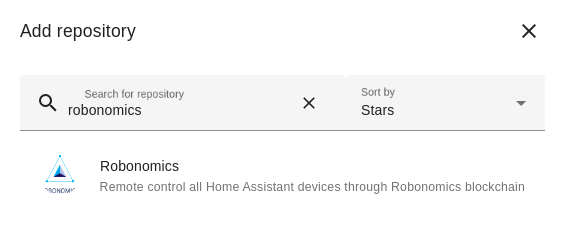

# Connect your Home Assistant devices to web3 infrastructure 

Integration gives you the remote access to your local smart home through encrypted transactions in Robonomics blockchain. It allows:

* Whatch current states
* Call services
* Manage Home Assistant users with subscription devices
* Create backups

More information you can find on [Robonomics Wiki](https://wiki.robonomics.network/docs/en/home-assistant-begin/).

## Requirements

To ensure proper functionality, your Home Assistant computer must have a local IPFS node installed. You can install it in the following ways:

* As an add-on for the supervisor or Home Assistant OS, using this [link](https://github.com/airalab/ipfs-addon).
* By using the installation script for Home Assistant core or Docker. Follow these steps:

```bash
wget https://raw.githubusercontent.com/airalab/robonomics-hass-utils/main/raspberry_pi/install_ipfs_arc_dependent.sh
bash install_ipfs_arc_dependent.sh
rm install_ipfs_arc_dependent.sh
```

## Installation

**1. Install files**

1.1) Using HACS

In the HACS panel, go to `Integrations` and click on `Explore & Download Repositories` button and find Robonomics Integration:



Open it and press `Download this repository with HACS` in the end of the page.

1.2) Manually

Clone the [repository](https://github.com/airalab/homeassistant-robonomics-integration) and copy `custop_components` folder to your Home Assistant config

**2. Restart HA to load the integration into HA.**

**3. Go to Settings -> Devices & Services -> Integrations and click the 'Add Integration' button. Look for Robonomics and click to add it.**

## Configure

For the Robonomics integration you need an [account in Robonomics Network](https://wiki.robonomics.network/docs/en/create-account-in-dapp/) with [subscription](https://wiki.robonomics.network/docs/en/get-subscription/). Also you need a `controller` account added to subscription as a device (it must be ed25519 type). Controller account will send telemetry from Home Assistant and will be able to send commands to smart devices. 

Fields:

* **Robonomics controlle account seed**. 
Seed phrase of you `controller` account. Note that this seed is stored only on your local machine and integration use it to encrypt the data and send transactions from `controller` account.

* **Robonomics subscription owner address**. 
The address of the subscription owner account. It is needed for sending transactions using subscription.

* **Timeout for sending data to Robonomics**. 
Remote states will be updated with this timeout. Note that it shouldn't be too small, because you don't have the ability to send transactions using subscriptions too often.

* **Custom IPFS gateway**.
URL for the custom IPFS gateway. Default integration store data in local IPFS node, but you can add your custom gateway (recommended for backups) to improve connectivity.

* **Port for the custom IPFS gateway**.

* **Use controller seed gateway authentication**.
Tick it if your gateway uses web3 authentication.

* **Pinata public key**.
You also can use Pinata as a custom gateway. For that you need to add an API Key in your Pinata account.

* **Pinata private key**.


